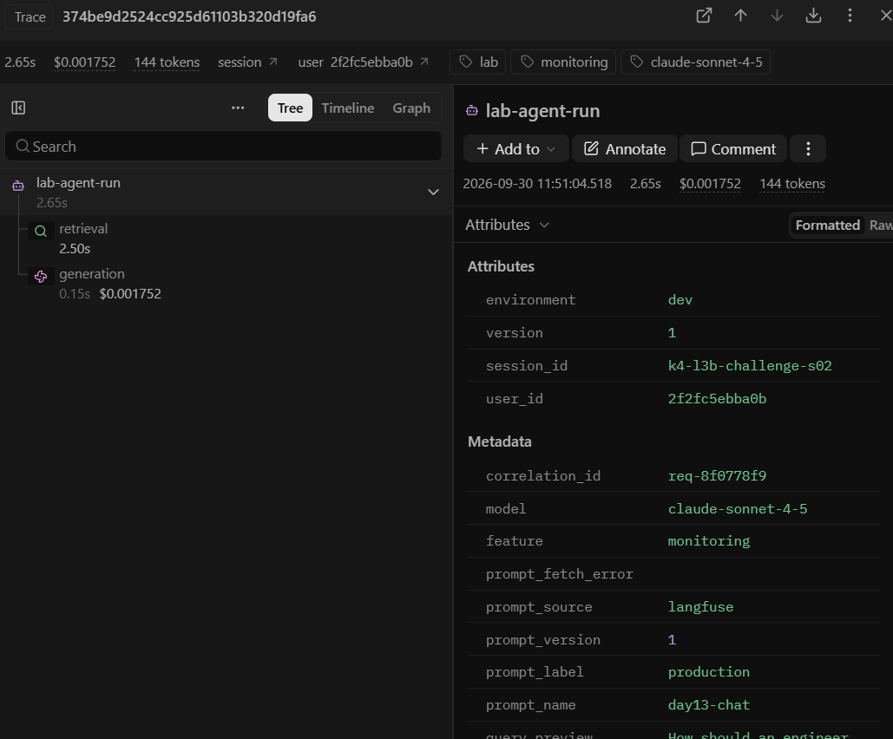

# Báo cáo cá nhân — K4-L3B Day 13 Monitoring & LLMOps

> Evidence nộp gồm ba output text và năm ảnh runtime theo `docs/SUBMISSION.md`. Các ảnh runtime được chọn từ loạt ảnh kiểm tra chi tiết và dẫn bằng đường dẫn tương đối.

## 1. Thông tin học viên

- **Họ và tên:** Phạm Hoàng Trọng
- **MSSV:** 2A202602765
- **Lớp:** K4-L3B
- **Repository URL:** https://github.com/ToRong31/K4-L3B-Day13-PhamHoangTrong-2A202602765-Monitoring-LLMOps.git
- **Commit SHA cuối:** Chờ commit nộp CP4
- **Challenge ID:** `day13-k4-l3b-monitoring-llmops-v1`
- **Tên project Langfuse cá nhân:** `day13-k4-l3b-2A202602765`

## 2. Evidence index

Ba output text và năm ảnh nộp chính thức dưới đây bao quát logging/PII, tracing, prompt versioning, dashboard và incident. Các ảnh có tên `06`–`14` được chụp để kiểm tra từng tiêu chí; năm ảnh trong bảng là bản sao nguyên vẹn của những ảnh phù hợp, không chỉnh sửa nội dung.

| Evidence | Đường dẫn |
|---|---|
| Pytest cuối | [pytest.txt](evidence/pytest.txt) |
| Log validator | [log-validator.txt](evidence/log-validator.txt) |
| Dashboard validator | [dashboard-validator.txt](evidence/dashboard-validator.txt) |
| Structured log và incident log | [01-incident-log.png](evidence/01-incident-log.png) |
| Trace list trong project cá nhân | [02-trace-list.png](evidence/02-trace-list.png) |
| Trace tree, metadata và incident trace | [03-incident-trace.png](evidence/03-incident-trace.png) |
| Prompt versions và rollback | [04-prompt-versioning.png](evidence/04-prompt-versioning.png) |
| Dashboard sáu panel và incident metric | [05-dashboard-incident.png](evidence/05-dashboard-incident.png) |

## 3. Kết quả kỹ thuật

| Nội dung | Baseline | Kết quả cuối | Nhận xét |
|---|---|---|---|
| `validate_logs.py` | 30/100 | 100/100 | 36 log records, 18 correlation IDs, 0 PII leak; gồm workload CP3 và request PII giả |
| `validate_dashboard.py` | 6/6 panel | 6/6 panel | Có dashboard runtime từ log thật |
| `pytest` | 22 passed | 24 passed | Bao gồm public test tracing/prompt |
| Số trace đủ cây | 1 | 15 | 15/15 request của workload CP3 đối chiếu được với trace qua API v2; cả 5 request challenge có cây đầy đủ |
| Số PII leak | 0 | 0 | Validator trên log CP3 mới |
| Latency P95 / TTFT P95 | Baseline CP3: 151–157 ms / 50 ms | 2651.25 ms / 50 ms trên dashboard cuối | Dashboard có 16 request: 10 baseline, 5 challenge và 1 request PII giả; challenge có latency 2651–2652 ms |
| Retrieval success rate | 100% | 100% | Tính trên mọi event có `tool_success` |

## 4. Logging và PII

- **Cách tạo/nhận và truyền correlation ID:** Trong `CorrelationIdMiddleware`, gọi `clear_contextvars()` để làm sạch context cũ, sau đó đọc `x-request-id` từ request headers (nếu có) hoặc tự sinh mã theo format `req-<8-hex>` (`f"req-{uuid.uuid4().hex[:8]}"`). Tiến hành `bind_contextvars(correlation_id=correlation_id)` vào structlog, lưu vào `request.state.correlation_id`, và trả về client qua response headers `x-request-id` cùng `x-response-time-ms`. Request điều tra trong ảnh 01 và 03 có `correlation_id=req-8f0778f9`.
- **Các metadata được ghi vào structured log:** Gồm các trường schema cơ bản (`ts`, `level`, `service`, `event`), mã theo dõi `correlation_id`, và các trường enrichment ngữ cảnh: `user_id_hash` (băm SHA256 lấy 12 ký tự đầu), `session_id`, `feature`, `model`, `env`, cùng các trường đo lường latency, tokens, cost, quality.
- **Cách bảo đảm PII được scrub trước khi ghi:** Đăng ký processor `scrub_event` trong chuỗi structlog processors trước `JsonlFileProcessor` và `JSONRenderer`. Processor này quét và scrub đệ quy mọi chuỗi trong `event_dict` bằng hàm `scrub_text`, áp dụng các regex pattern để thay thế thông tin nhạy cảm thành `[REDACTED_EMAIL]`, `[REDACTED_PHONE_VN]`, `[REDACTED_CCCD]`, `[REDACTED_CREDIT_CARD]`.
- **Cách kiểm chứng kết quả:** Bổ sung unit tests cho CCCD và thẻ tín dụng trong `tests/test_pii.py` (24/24 tests pass). Sau workload CP3, gửi thêm một request chứa email giả với `correlation_id=pii-demo-0930-01`; log `request_received` chỉ còn `[REDACTED_EMAIL]` trong `message_preview`. Kết quả cuối của `python scripts/validate_logs.py` là 100/100 trên 36 records, 18 correlation IDs, 0 PII leaks và đầy đủ enrichment fields; xem [log-validator.txt](evidence/log-validator.txt).

## 5. Tracing và prompt versioning

- **Cách xác nhận traces do chính tôi tạo trong project cá nhân:** `.env` chứa key của project `day13-k4-l3b-2A202602765`; tôi gửi workload baseline và challenge, rồi dùng Langfuse Observations API v2 đối chiếu `correlation_id` với `data/logs.jsonl`. Cả 15/15 request trong log CP3 mới có trace đủ cây; cả 5 request challenge đều có trace. [Ảnh trace list](evidence/02-trace-list.png) cho thấy project cá nhân và trên 10 trace.
- **Cấu trúc root/retrieval/generation observations:** Trace tên `day13-agent-request` có observation cha `lab-agent-run`; hai observation con là `retrieval` (`RETRIEVER`) và `generation` (`GENERATION`). Trace v2 `6244fabae68e8c500a12b51b8b1c3794` cho thấy hai observation con cùng parent ID `bae3fd6fadc14ad5`; generation có model `claude-sonnet-4-5`, 41 input token, 161 output token, cost 0.002538 USD và liên kết prompt `day13-chat` v2. Các decorator tắt capture input/output để không đưa câu hỏi thô vào trace. Vì vậy cột Input/Output trong Langfuse hiển thị rỗng; token/cost vẫn nằm ở Usage/Cost của generation.
- **Cách nối trace với log:** Trace CP3 `374be9d2524cc925d61103b320d19fa6` có `correlation_id=req-8f0778f9`, trùng hai event `request_received` và `response_sent` trong `data/logs.jsonl`. Hai trace v1/v2 ở mục so sánh prompt thuộc workload CP2 trước khi chuyển log cũ ra ngoài repo.
- **Prompt name:** text prompt `day13-chat`, giữ nguyên `{{feature}}`, `{{docs}}`, `{{message}}`.
- **Version/label baseline:** v1 gắn `baseline`, cuối bài gắn thêm `production`.
- **Version/label candidate:** v2 gắn `candidate` và label hệ thống `latest`; thêm dòng “Trả lời ngắn gọn.” sau template v1.
- **Trace ID của mỗi version:** cùng input ở session `s01`: v1 `26baea6c54baaf5d8a74d2226cff290e` (`baseline`, `req-3059781a`); v2 `6244fabae68e8c500a12b51b8b1c3794` (`candidate`, `req-eac2e572`). Cả hai có `prompt_source=langfuse`, không dùng fallback.
- **Cách promote và rollback `production`:** dời `production` sang v2, request kiểm tra `req-c2f1ea0e` tạo trace `16632f9dd45efbff4e9a78dc67f53db0` có metadata `prompt_label=production`, `prompt_version=2` và dùng 41 input token. Sau đó dời `production` về v1; request `req-662a1688` dùng 36 input token. [Ảnh prompt versioning](evidence/04-prompt-versioning.png) đặt trace v2 cạnh trang versions sau rollback: `production` + `baseline` ở v1, `candidate` + `latest` ở v2. API được khởi động mới sau mỗi lần đổi label; `.env` cuối cùng là `LANGFUSE_PROMPT_LABEL=production`.

## 6. Dashboard, SLO và alerts

- **Dashboard và sáu panel:** chạy `python scripts/dashboard.py`, mở `http://127.0.0.1:8501`. Dashboard đọc `data/logs.jsonl` mỗi 30 giây, cửa sổ 60 phút UTC, có Latency (P50/P95/P99 và TTFT P95), Traffic, Errors (error rate/retrieval success), Cost, Tokens và Quality. Mỗi panel có đơn vị và threshold theo `config/dashboard.yaml`; [ảnh dashboard](evidence/05-dashboard-incident.png) chụp sau challenge CP3.
- **SLO và lý do chọn:** `config/slo.yaml` đặt mục tiêu 99.5% request trong 28 ngày có `response_sent` với latency ≤ 3000 ms. Baseline CP3 có median 151 ms (151–157 ms); 5 request challenge tăng lên 2651–2652 ms. Dashboard cuối, sau một request PII giả bổ sung, hiển thị P95 = 2651.25 ms trên 16 requests, vẫn dưới đường SLO 3000 ms. Ngưỡng phát hiện challenge là 2000 ms, khác ngưỡng SLO.
- **Cách tính error budget:** 100% − 99.5% = 0.5%; với 10000 request trong 28 ngày, tối đa 50 request được phép lỗi, thiếu response hoặc chậm trên 3000 ms. Với 1000 request, tối đa 5 request.
- **Ba alert và runbook tương ứng:** `HighAnswerLatencyP95` (>3000 ms, 5m, warning), `ElevatedRequestErrorRate` (>2%, 5m, critical, tối thiểu 20 request), `AnswerQualityDegraded` (<0.75, 10m, warning, tối thiểu 20 response). Cả ba gửi Slack `#k4-l3b-alerts`, owner `student-2A202602765`, có quy trình Metrics → Logs → Traces và mitigation tại `docs/alerts.md`.

> Ví dụ cách viết error budget: "SLO 99.5% trong 28 ngày nghĩa là error budget 0.5%. Nếu workload có 10,000 request thì tối đa 50 request được phép lỗi hoặc chậm hơn ngưỡng SLO."

## 7. Điều tra challenge

- **Challenge ID:** `day13-k4-l3b-monitoring-llmops-v1`, cohort K4, scenario `rag_slow`, seed 1312; dùng nguyên file `config/challenge.json` có sẵn trên máy, giữ file ngoài Git theo hướng dẫn CP3.
- **Chuẩn bị và thời gian:** Chuyển log CP2 ra ngoài repo, kiểm tra `/health` có mọi incident `false`, chạy baseline một lần gồm 10 request. API chạy không có `--reload` ở cổng 8007 vì cổng mặc định 8000 đã bị chiếm; các script dùng `DAY13_BASE_URL=http://127.0.0.1:8007`. Incident bật lúc 04:50:57 UTC và tắt lúc 04:51:25 UTC ngày 30/09/2026 (11:50:57–11:51:25 Asia/Saigon). Chạy `python scripts/inject_incident.py` rồi `python scripts/load_test.py --challenge --concurrency 5`.
- **Triệu chứng từ metrics:** Baseline 10 request có median 151 ms (151–157 ms). Cả 5 request challenge có `latency_ms` 2651–2652 ms trong log/dashboard, đều vượt ngưỡng challenge 2000 ms; [dashboard](evidence/05-dashboard-incident.png) cho thấy độ trễ tăng rõ ở phút 04:51 UTC. Ảnh dashboard cuối có thêm một request PII giả (16 requests tổng cộng), P95 = 2651.25 ms, vẫn dưới đường SLO 3000 ms. Error rate 0% và retrieval success 100%. Đây là độ trễ phía server, không dùng thời gian client mà `load_test.py` in khi 5 request xếp hàng.
- **Log line và correlation ID liên quan:** [Dòng `response_sent` trong `data/logs.jsonl`](evidence/01-incident-log.png) của `req-8f0778f9` lúc 04:51:07.171254 UTC ghi `latency_ms=2652`, `feature=monitoring`, `model=claude-sonnet-4-5`, `tool_success=true`; trước đó có event `incident_enabled` tên `rag_slow`.
- **Trace ID và span gây ảnh hưởng:** [Trace `374be9d2524cc925d61103b320d19fa6`](evidence/03-incident-trace.png) có cùng `correlation_id=req-8f0778f9`; root `lab-agent-run` dài 2.65 s, child `retrieval` 2.50 s, child `generation` 0.15 s. Prompt là `day13-chat` `production` v1, tổng 144 token, cost $0.001752.
- **Root cause:** Challenge bật `rag_slow`; trong `app/mock_rag.py`, nhánh này thêm 2.5 giây chờ ở `retrieve`. Trace xác nhận thời gian tập trung ở retrieval, trong khi generation chỉ 0.15s.
- **Fix action:** Tắt scenario bằng `python scripts/inject_incident.py --disable`; log ghi `incident_disabled` lúc 04:51:25.966052 UTC, `/health` xác nhận mọi incident `false`. Giữ label prompt `production` tại v1 vì prompt không phải nguyên nhân incident.
- **Preventive measure:** Đề xuất thêm cảnh báo riêng cho retrieval vượt 2000 ms để bắt suy giảm trước khi chạm SLO 3000 ms; dùng runbook Metrics → Logs → Traces trong `docs/alerts.md` để so `correlation_id` và thời lượng retrieval. Alert hiện có `HighAnswerLatencyP95` ở ngưỡng 3000 ms chưa bắt được lần challenge này.

## 8. Giải thích và tự đánh giá

- **Một quyết định kỹ thuật quan trọng và lý do:** Dùng decorator `@observe` trên `retrieve` và `FakeLLM.generate` để Langfuse tự giữ quan hệ parent/child và public test cùng dùng được; tắt capture input/output, chỉ ghi model, usage, cost và đối tượng managed prompt lên generation.
- **Một lỗi/blocker đã gặp:** Langfuse Cloud đôi lúc trả prompt sau hơn 2 giây; request `candidate` đầu tiên rơi về `local-fallback`, và API đọc observations có lúc timeout.
- **Cách tìm nguyên nhân và xử lý:** Kiểm tra `prompt_source`/`prompt_fetch_error` trong metadata, so token input của v1/v2 và thử fetch prompt trực tiếp. Thêm biến `LANGFUSE_PROMPT_FETCH_TIMEOUT_SECONDS=10` trong `.env`, khởi động API mới và chỉ chọn trace có `prompt_source=langfuse` làm evidence v1/v2. Log CP2 cũ được chuyển ra ngoài repo trước CP3 để dashboard CP3 chỉ đọc baseline và challenge mới.
- **Cách hiểu luồng Metrics → Logs → Traces:** dashboard chỉ ra phút và metric bất thường; log trong phút đó cung cấp `correlation_id`; trace cùng ID cho biết thời lượng và trạng thái của `retrieval`/`generation`, cùng prompt version đã dùng.
- **Vai trò của prompt version, token/cost, SLO hoặc rollback trong vận hành LLM:** Label `production` là con trỏ tới version; v2 thay prompt nên input token tăng từ 36 lên 41 trên cùng câu hỏi, trong khi FakeLLM vẫn trả cùng kiểu câu trả lời. Usage/cost trên generation cho phép theo dõi chi phí; SLO/error budget đo mức ảnh hưởng của request chậm; rollback chỉ dời label về v1 và restart API.
- **Điều quan trọng nhất đã học:** Metadata prompt phải đến từ bản Langfuse thực được tải, không được tự gắn version khi fallback; trace cần nối được với log qua `correlation_id`.
- **Hạn chế hoặc phần chưa hoàn thành, nếu có:** 15/15 request trong log CP3 mới có trace đầy đủ. Ngưỡng alert P95 hiện tại là 3000 ms nên không phát hiện challenge ở mức 2651–2652 ms; cần cảnh báo retrieval riêng ở mức 2000 ms.

## 9. Checklist trước khi nộp

- [ ] Kết quả và evidence thuộc commit SHA cuối.
- [ ] Tất cả ảnh/output mở được bằng đường dẫn tương đối.
- [ ] Có đúng 3 file text và 5 ảnh runtime theo hướng dẫn.
- [ ] Incident evidence nối đúng metric → log → trace.
- [ ] Trace/prompt evidence thuộc project Langfuse cá nhân và ảnh không lộ key/secret.
- [ ] Repository chạy lại được theo README.
- [ ] Không có secret, API key, PII thô hoặc evidence của người khác/lớp khác.
- [ ] URL repo và commit SHA cuối đã được nộp trên LMS/Codelabs.
